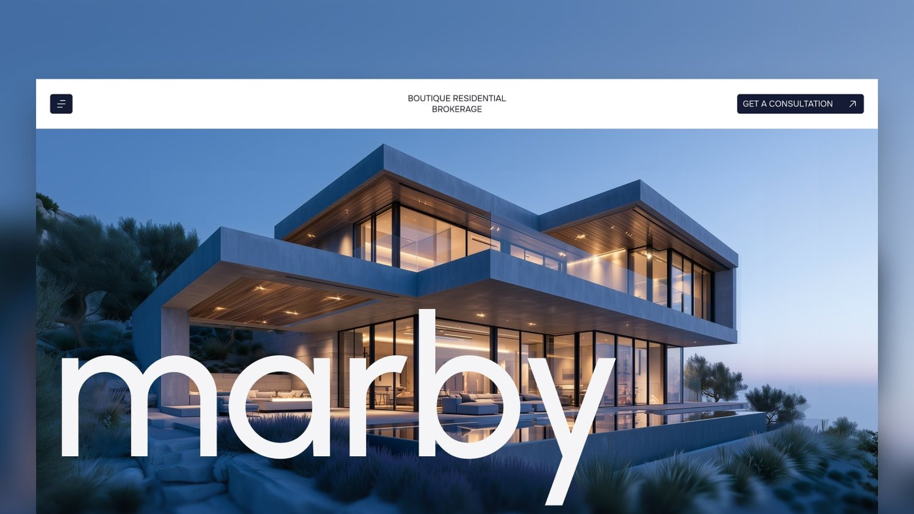

<p align="center">
  <a href="https://startfrom.co/templates/marby?utm_source=github&utm_medium=readme&utm_campaign=marby"></a>
</p>

<p align="center">
  <a href="./LICENSE"></a>
  
  
  
</p>

<p align="center">
  <a href="https://marby.startfrom.co"><b>Astro demo</b></a>
  &nbsp;·&nbsp;
  <a href="https://marby-next.startfrom.co"><b>Next.js demo</b></a>
  &nbsp;·&nbsp;
  <a href="https://startfrom.co/templates/marby?utm_source=github&utm_medium=readme&utm_campaign=marby"><b>Startfrom</b></a>
</p>

# Marby, a real estate theme for Astro and Next.js

A quiet, editorial theme for boutique real estate agencies and brokerages: property listings with filters, detail pages with photo galleries, a blog, team and office pages. Static output, no UI framework: every interaction is a small vanilla TypeScript module.

<!-- next -->
The same site also ships as a **Next.js** app in [`next/`](next/) (Next.js 16, App Router, React 19, static export). It is generated from this Astro source and checked against it element by element on every page, so the two builds look and behave the same. Use whichever stack you prefer; [`next/README.md`](next/README.md) has its commands and file map.
<!-- /next -->

## Features

- Full-bleed video hero with the brand wordmark
- Services as stacking sticky cards, offices as a sticky stack on the contact page
- Property listing with category tabs and live search
- Property pages generated from Markdown: specs, highlights, map, nearby places, lead advisor card and a photo gallery grouped by room with a lightbox
- Blog with category filters, related articles and Markdown posts
- Testimonial slider, glass feature cards, a team ticker that reveals portraits on hover
- FAQ accordions (one open at a time), contact form with loading and success states
- Overlay menu; the nav caption flips colour over dark sections
- Lenis smooth scrolling and scroll-triggered reveals
- Honours `prefers-reduced-motion`: smooth scrolling, the ticker and reveals switch off, the layout stays intact
- Urbanist and Onest, self-hosted through Fontsource

## Getting started

```sh
npm install
npm run dev      # http://localhost:4321
npm run build    # outputs to dist/
npm run preview  # serves dist/
```

## Pages

| Route | What it is |
| --- | --- |
| `/` | hero, about, services, featured listings, testimonials, features, team, FAQ |
| `/about-us` | vision and mission, milestones, beliefs, FAQ, team |
| `/property` | listing grid with tabs and search, FAQ tiles |
| `/property/[slug]` | one page per file in `src/content/properties/` |
| `/blog` | article grid with category filters |
| `/blog/[slug]` | one page per file in `src/content/blog/` |
| `/contact` | office cards, FAQ |
| `/terms-conditions` | terms |
| `/404` | not found |

The contact form and footer appear on every page except the 404.

## Editing content

- `src/content/site.json` holds all other copy: navigation, footer, socials, home sections, team, testimonials, FAQs, offices, about page, terms and labels.
- `src/content/properties/*.md`: one file per property. The frontmatter holds the specs, highlights, nearby places and gallery images; the Markdown body is the description. The filename is the URL.
- `src/content/blog/*.md`: one file per article (`order`, `title`, `date`, `category`, `image`). The filename is the URL.
- Schemas for both collections are in `src/content.config.ts`, so a typo in a field fails the build instead of breaking a page.
- Images and the hero video live in `public/assets/`.
- Colours, the type scale and easings are custom properties in `src/styles/tokens.css`; shared styles are in `src/styles/global.css`. Each component keeps its own styles.

## Project structure

```
src/
  components/        Nav, Footer, Btn, Icon, StoreBadge
    sections/        one component per page section
    ui/              cards and FAQ rows
  content/           site.json, properties/, blog/
  icons/             SVG icons
  layouts/Base.astro head, nav, footer, scripts
  pages/             routes
  scripts/           one module per behaviour, wired in entry.ts
  styles/            tokens.css, global.css
```

## Environment variables

All optional and off by default.

| Variable | Effect |
| --- | --- |
| `PUBLIC_FORM_ENDPOINT` | URL the contact form posts to (Formspree, Basin, ...). Unset, the form only shows its states. |
| `PUBLIC_VERCEL_ANALYTICS` | `true` loads Vercel Web Analytics and Speed Insights |
| `PUBLIC_STORE_BADGE` | `true` shows the fixed store badge in the corner |

<!-- next -->
## Next.js version

`next/` is a standalone Next.js app: `cd next && npm install && npm run dev`. Its pages, components, styles and copied content are generated from this Astro source, so make changes here and regenerate:

```sh
node tools/astro-to-next.mjs   # .astro -> .tsx, content, scripts, icons
node tools/collect-css.mjs     # component styles -> next/src/styles/site.css
```

A few files in `next/` are written by hand because they have no Astro equivalent to convert: `src/layouts/Base.tsx`, `src/app/layout.tsx`, `src/app/Scripts.tsx`, `src/lib/content.ts` (Markdown collections), `src/app/sitemap.ts` and `src/app/robots.ts`. If you only use the Next.js build, you can also edit `next/` directly and ignore the Astro files.
<!-- /next -->

## Deploy

The build is plain static files in `dist/`, so it runs on any static host. On Vercel or Netlify, import the repo and keep the defaults (build command `npm run build`, output `dist`). Set `site` in `astro.config.mjs` to your domain so canonical and Open Graph URLs are correct.

## License and credits

MIT, see `LICENSE`. Fonts: Urbanist (The Urbanist Project Authors) and Onest (The Onest Project Authors), both under the SIL Open Font License 1.1. Names, addresses and photos in the demo are placeholders; replace them with your own. The property map embeds Google Maps.
